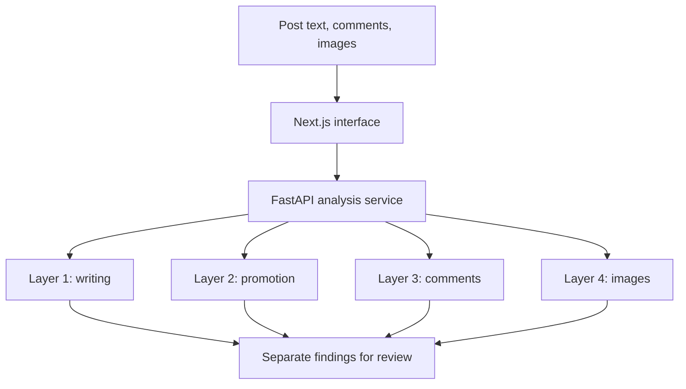

# XHS Verifier | 小红书内容核验系统

**A four-layer prototype for reviewing potentially misleading Xiaohongshu (RedNote) posts.**  
**面向小红书（RedNote）内容的四层辅助核验原型。**

[English](#english) · [简体中文](#简体中文) · [Data and model credits / 数据与模型致谢](#data-and-model-credits--数据与模型致谢)

> **Project status (8 October 2026):** The four analysis paths and a Next.js interface have been built and tested locally. The numbers below come from different project evaluation sets; they are not one overall accuracy figure. A new, independent Layer 4 image test set is still being collected. Public deployment is a separate step.
>
> **项目状态（2026 年 10 月 8 日）：** 四项分析流程与 Next.js 前端已完成本地开发和测试。下文各项数字来自不同的项目测试集，不能合并为“整体准确率”。Layer 4 的全新独立图片测试集仍在采集中，公开部署尚需单独完成。

---

## English

### Why this project exists

A social post can look convincing for several different reasons. The writing may be generated or heavily rewritten; a product recommendation may quietly function as an ad; a comment section may appear to contain many independent endorsements even when the replies are unusually similar; and a photograph may fail to support the accompanying claim. Looking at only one of these signals leaves important evidence out.

XHS Verifier lets a reviewer submit post text, comments, and images, then returns separate findings for four questions. It is a **review aid**, not a fact checker with access to purchase records, a platform's account graph, or the author's intent. A flagged result means “look closer at this evidence,” not “this person committed fraud.”

### What a user does

1. **Paste the post text.** This supplies the words for Layer 1 (writing pattern), Layer 2 (possible disguised promotion), and, if images are provided, Layer 4 (caption versus picture).
2. **Add comments.** Paste individual comments or upload a cropped comment-section screenshot. The screenshot path reads visible text with OCR, lets the user inspect/correct extracted comments, and then passes the comment group to Layer 3. At least five usable comments are needed for the comment-group analysis.
3. **Add post images, if available.** Layer 4 checks whether the picture broadly matches the post's words and extracts readable text from images. A second, separate comparison tool accepts a *suspected image* and a *trusted original/reference image* to look for edits. An unverified reference weakens the conclusion.
4. **Review each finding separately.** The interface shows results and underlying scores/evidence. An unavailable or insufficient-evidence result should be read as “no supported conclusion,” never as “safe” or a zero-risk score. The reviewer checks context before making a decision.

**Example:** A post says “This is a sunscreen I used for two weeks,” shows a photo of face wash, and has fifteen very similar praise comments. Layer 4 may flag the mismatch between the product named in the text and the photographed item; Layer 3 may flag the repetitive comment pattern. Neither finding proves who wrote the post or whether the comments came from bots.

### The four layers

| Layer | Question for a nontechnical reader | Input → process → output | What it cannot establish |
| --- | --- | --- | --- |
| **1 · Writing origin** | “Does the writing resemble the AI-written examples the model learned from?” | Post text → clean text and turn word patterns into numeric features (TF-IDF) → a trained logistic-regression classifier estimates AI-writing involvement. | It cannot identify the exact author/model, measure an exact percentage of AI editing, or prove AI use from style alone. |
| **2 · Hidden promotion** | “Does this recommendation read like an undisclosed ad?” | Post text → a trained covert-ad detector evaluates promotional language and context → a risk estimate for possible disguised advertising. | A positive score is not proof of sponsorship or a legal judgment about disclosure. Genuine reviews can sound promotional. |
| **3 · Comment coordination** | “Do the comments behave like independent replies or like repeated talking points?” | A group of comments → compare exact repetitions and semantic similarity (different wording with similar meaning) → a classifier estimates coordination risk. Comment screenshots first pass through OCR. | Similar comments, popular phrases, and multiple people asking the same question do not prove bots or paid activity. The model does not verify account ownership. |
| **4 · Visual consistency** | “Does the picture fit the caption, and was it changed compared with a trusted original?” | Post image + text → image/text similarity and OCR; or suspected image + original → structural/color/change-region features → separate mismatch/edit signals. | A mismatch is not proof the image is AI-generated. Normal cropping, lighting, compression, or a poor reference may trigger differences. |

#### Layer 1: from text to a cautious authorship signal

The system first cleans the supplied text so the model can read it consistently. TF-IDF then gives weight to words and phrases according to how informative they were in the project's labeled examples. Logistic regression learns a boundary between the example classes. When a new post arrives, it applies the same preparation and returns a score and label. The score describes the model's learned pattern on this dataset; it is not a forensic measurement of how many characters were written by AI. Short posts, new slang, deliberate rewrites, and different writing topics can change performance.

#### Layer 2: examining advertising language

Covert advertising is more subtle than a post that simply says “buy this now.” A creator may tell a personal story while repeating a product claim, purchase cue, or unusually polished endorsement. This layer evaluates the text for patterns learned from labeled disguised-ad and comparison posts. The user sees a separate signal so authorship and promotion are not confused: a human can write an ad, and an AI-written post need not advertise anything. The label should lead to a manual check of disclosures, context, and evidence of a commercial relationship.

#### Layer 3: looking across a *group* of comments

This layer is about relationships among replies, rather than whether any one comment sounds enthusiastic. It normalizes comments, counts exact repeats, and uses a Chinese sentence-embedding model to compare meaning even when the wording changes. Summary features describe repeated phrases, unusually close pairs, and how tightly a group clusters; a trained classifier maps those features to a coordination score. Comment count is reported, but the model's coordination feature set deliberately excludes it so a busy thread is not suspicious just because it is busy. For screenshots, OCR reads lines first; users should crop to the comments and correct extraction errors before relying on the result. The model needs at least five extracted comments. A set of comments asking “link?” or “what shade?” can be perfectly ordinary.

#### Layer 4: two distinct visual questions

**A. Caption ↔ image.** The image and Chinese caption are converted into representations that can be compared by a SigLIP2-based model. A low similarity score relative to the project's fixed development threshold (`0.0278`) may flag a mismatch. OCR also returns visible text from the image for human review. The number is a model score, not a percentage of truth. For example, a moisturizer caption paired with a face-wash picture can be suspicious; a broader lifestyle caption may be too vague to judge confidently.

**B. Suspected image ↔ trusted reference.** The user supplies both pictures. The system aligns/compares their structure and color and measures changed regions; a fitted reference-comparison model reports edit probability and a decision against its saved threshold (`0.2782`). Examples include changed prices, added “official” badges, altered packaging text, or modified product claims. Ordinary resizing, color adjustment, filters, and JPEG compression can also create pixel differences. This task therefore requires a reliable original and human review of *what* changed. It does **not** claim that every retouched image is deceptive.

The two thresholds were chosen on development data. They must **not** be retuned using the new independent test images and then reported as if those images remained an untouched test set.

### Results so far, with the test conditions

| Component | Data/evaluation recorded so far | Result | How to interpret it |
| --- | --- | --- | --- |
| Layer 1 | 19,667 filtered text examples; a locked project test split | **97.52% F1; 99.31% ROC-AUC** | Strong separation on that project test distribution; not a platform-wide detection rate. The exact source composition and test count need to be copied from the current data manifest before a stronger claim is made. |
| Layer 2 | 328 held-out labeled posts | **87.2% accuracy; 63.8% F1** | An ad detector can get many examples right while still missing or overflagging a meaningful fraction of covert ads. Report F1 as well as accuracy. |
| Layer 3 | Development set of **291 comment groups: 191 negative and 100 team-built positive** groups; a separate, manually screened **30-group provisional negative control** set was prepared from the Kaggle XHS AIGC comments resource | **No verified generalization score stated here** | The 291 are development examples, not 291 confirmed real cases of coordination. The extra 30 are provisional non-coordination labels based on visible comments, not a platform investigation; do not combine them into training and call them independent evaluation. |
| Layer 4A | **60 controlled development cases** for caption/image alignment | **93.3% five-fold accuracy** | Cross-validation on a small controlled development set, not performance on newly collected real-world posts. Fixed similarity threshold: **0.0278**. |
| Layer 4B | Team-constructed reference/edit pairs within the Layer 4 development collection | Fixed edit threshold: **0.2782**; no independent-test metric claimed | An edited sample and its original are deliberately paired. Do not quote an accuracy for unseen edits until the independent set is evaluated. |

Layer 4 development records contain `case_001`–`case_100`, with matching/mismatching caption examples and original/edited image comparisons. The team's separate **30-case holdout plan** calls for 20 new caption/image cases (10 matched, 10 mismatched) and 10 new reference comparisons (5 ordinary/unchanged, 5 edited). This is a collection target, **not 30 completed test results**. Ground truth should be recorded before inference, no old development image should be reused, and the two fixed thresholds must stay fixed.

**Metric glossary:** Accuracy is the share of evaluated cases classified correctly. Precision asks how many flagged cases really belonged to the flagged class. Recall asks how many actual cases were found. F1 balances precision and recall. ROC-AUC measures ranking across thresholds. Five-fold evaluation repeatedly trains on four portions and evaluates on the fifth; it is different from a final untouched holdout.

### How the pieces connect



The web interface is built with Next.js, React, and TypeScript. The Python FastAPI service runs the detectors and exposes analysis endpoints. Project scripts prepare labeled datasets, build features, train/calibrate models, and evaluate them. The visible interface presents findings; it does not run the large Python models inside the browser or a small serverless frontend function.

### Run locally (for contributors)

Commands below assume a checkout with `backend/` and `frontend/`, Python, and Node.js/npm. Large model weights may download on first run, so allow disk space and time. Check `backend/requirements.txt`, `frontend/package.json`, and the current environment examples for the precise version and settings in your branch.

```bash
git clone https://github.com/jiaweiz5/projectdounai.git
cd projectdounai/backend
python3 -m venv .venv
source .venv/bin/activate
python -m pip install -r requirements.txt
uvicorn main:app --reload --port 8000
```

In a second terminal:

```bash
cd projectdounai/frontend
npm install
npm run dev
```

Open `http://localhost:3000` for the interface and `http://localhost:8000/docs` for FastAPI's interactive API documentation. If the frontend proxy uses a backend URL, set `BACKEND_URL=http://127.0.0.1:8000` in `frontend/.env.local` and restart the frontend. Keep secrets in local environment files, never in Git. If a route fails, first confirm that the backend is running and the model/data files expected by that route are present.

The backend exposes `/health`, `/analyze` for the combined analysis, `/analyze-screenshot` for comment OCR plus Layer 3, and `/analyze-layer4-reference` for two-image comparison in the recorded implementation. Use `/docs` to inspect the exact request schema for your checked-out revision; comment objects and plain strings have differed during development, so avoid copying an old JSON example blindly. From `frontend/`, `npm run build` checks the production frontend build; it does not validate model accuracy or backend deployment.

### Data ethics and limitations

- A training or cross-validation result is not a guarantee on future Xiaohongshu posts. Topic, language style, image quality, and editing practices can shift.
- A “negative” comment group labeled by visual inspection means **no visible evidence of coordination**; it does not prove independent account ownership. The 30 external groups are explicitly provisional.
- A credible reference image needs a recorded origin. Without one, the comparison only says two pictures differ.
- Do not publish raw user IDs, avatars, contact details, or unrelated private information from source datasets. Check dataset permissions and the underlying platform's terms before redistributing media or records.
- A high-risk flag should initiate manual review and a clear explanation of the observable evidence. The tool should not automatically accuse a creator, reviewer, or brand.

---

## 简体中文

### 项目要解决什么问题

一篇小红书笔记可能在多个环节影响读者判断：文案可能由 AI 生成或改写；看起来像亲身体验的推荐可能带有隐性广告性质；评论区看似有很多独立用户认可，实际上却出现大量相似话术；图片也可能与文案不符，或者与可信原图相比发生了修改。只看其中一个信号，容易漏掉其他线索。

XHS Verifier 把这些问题分成四层，分别返回可供复核的结果。它是**辅助核验工具**，没有平台后台的账号关系、交易记录，也无法直接知道作者的真实意图。出现“可疑”代表值得进一步查看，**不代表系统已经证明某位用户造假**。

### 普通用户怎样使用

1. **粘贴笔记文案。** 第一层分析文字写作特征，第二层分析隐性推广风险；如果还上传图片，第四层会检查图文关系。
2. **提供评论。** 可以逐条输入评论，也可以上传只包含评论区的截图。系统先用 OCR 识别截图文字，用户检查和修改识别结果后，再对整组评论进行第三层分析。至少需要五条可用评论。
3. **按需上传图片。** 第四层可以把笔记图片与文案比较，并提取图片中的可读文字。另一个独立功能要求同时上传“待核验图片”和“可信原图”，用于比较是否存在修改。原图来源不可靠时，比较结论也会变弱。
4. **分别阅读四层结果。** 关注分数、依据和“无法分析/证据不足”等状态；后者的意思是暂时无法得出可靠判断，不能当作“零风险”。最后仍由人结合上下文复核。

**例子：** 文案说“这款防晒我用了两周”，配图却是洁面乳，评论区还有十五条措辞高度相似的夸赞。第四层可能提示图文不符，第三层可能提示评论重复。两者都不能单独证明是谁写的文案，也不能证明评论账号是机器人。

### 四层分别做什么

| 层级 | 用普通话解释的问题 | 输入 → 处理 → 结果 | 不能据此断言什么 |
| --- | --- | --- | --- |
| **第一层：文案来源特征** | “这段话是否像模型学过的 AI 文本？” | 输入笔记文字 → 清洗、提取词语特征（TF-IDF）→ 逻辑回归分类器给出 AI 写作参与风险。 | 无法锁定作者或具体模型，也不能精确计算“AI 写了百分之多少”。 |
| **第二层：隐性广告** | “这篇种草笔记是否可能在伪装成普通体验分享的同时进行推广？” | 输入笔记文字 → 根据已标注案例中学到的推广线索判断 → 输出疑似隐性广告风险。 | 无法直接证明商业合作，也不能代替对广告披露的人工或法律判断。 |
| **第三层：评论协同** | “这些评论像独立交流，还是反复出现相同卖点和话术？” | 输入一组评论 → 比较完全重复和语义相近内容 → 分类器输出协同风险；截图需先 OCR。 | 评论相似不等于水军，热门话题下很多人问同一个问题也很正常。 |
| **第四层：图片核验** | “图片与文案是否对应？和可信原图相比是否发生了值得关注的修改？” | 文案+图片进行图文比对及 OCR；或待检图+原图进行结构、颜色和变化区域比较 → 返回两个不同任务的风险信号。 | 图文不符不能证明图片由 AI 生成；色差、滤镜、裁剪、压缩也会造成图像差异。 |

#### 第一层：文案是怎样被分析的

系统先整理输入文字，使训练和实际使用时的处理方式一致。TF-IDF 会把词语和短语转换成数字特征，突出对区分样本有帮助的表达。逻辑回归模型在已标注的人写/AI 写样本上学习，再对新文字给出分数和分类。这个分数反映**当前数据分布下的模式相似性**，并不是司法鉴定，也不是 AI 改写比例。很短的笔记、新梗、不同题材和刻意改写的内容，都可能降低判断可靠性。

#### 第二层：如何识别“像普通分享的广告”

隐性广告不一定直接喊“赶紧购买”。有些笔记会以亲身体验、护肤心得或探店故事为包装，同时反复强调商品功效、购买引导和宣传话术。第二层利用已经标注的广告与非广告案例，给出一个需要复核的风险信号。它和第一层分开呈现：真人也会写广告，AI 文案也未必是广告。用户还应检查商业合作披露、上下文和其他可核实资料。

#### 第三层：看的是整组评论，不是单条“好评”

系统整理评论后，先看是否有完全相同的句子，再用中文句向量比较“字不一样但意思一样”的评论。它汇总重复比例、相近评论对、集中出现的相似表达等特征，然后估计协同风险。评论数量会显示给用户，但不作为协同分类器的输入特征，避免因为帖子很热就直接判为可疑。若上传的是截图，先把评论区域裁好，识别后逐条检查错字、漏字，再进行分析。至少需要五条评论。很多人都问“链接在哪”“什么色号”，本身完全可能是正常互动。

#### 第四层：图文错配与原图修改是两件事

**A. 图文一致性。** 系统用基于 SigLIP2 的模型分别表示图片和中文文案，再比较两者的语义接近程度；低于开发集确定的固定阈值 `0.0278` 时，可能提示图文错配。OCR 同时提取图片上能读到的文字，供用户核对。模型分数不是“真实概率”。比如文案介绍面霜、图片却是洁面乳，比“今天过得很开心”这种模糊文案更容易判断。

**B. 与可信原图比较。** 用户分别提供待核验图片和可信参考图。系统比较结构、颜色及局部变化，训练好的模型输出修改风险，并按保存的阈值 `0.2782` 判断。测试中的修改包括价格、认证标识、包装文字和宣传内容。日常修图、重新裁切、滤镜、压缩也可能产生变化，因此应由人判断**改了什么、是否影响核心信息**。系统不会把一切修图都当成欺骗。

两个阈值来自开发数据。采集全新独立测试图后，不能先看测试结果再调阈值，然后还宣称这些图片是“从未用于调参的独立测试集”。

### 已有测试数据与结果

| 模块 | 已记录的数据/评估方式 | 结果 | 正确理解方式 |
| --- | --- | --- | --- |
| 第一层 | **19,667** 条筛选后的文本；项目锁定测试集 | **F1 97.52%；ROC-AUC 99.31%** | 表示在该测试分布上的区分能力，不能说成小红书全平台准确率。原始数据来源占比和测试集条数仍需从当前数据清单核对。 |
| 第二层 | **328** 条留出标注笔记 | **准确率 87.2%；F1 63.8%** | 准确率之外还要看 F1；隐性广告仍可能漏报或误报。 |
| 第三层 | 开发集 **291 组评论：191 组负例、100 组团队制作正例**；另从 Kaggle 小红书 AIGC 评论数据整理出 **30 组人工初筛的暂定负例** | **此处不声称已经验证的泛化准确率** | 291 组是开发数据，不代表 291 起已查实事件；额外 30 组也只是根据可见评论暂定“未见协同证据”，不能证明真实账号关系。 |
| 第四层 A | 图文一致性 **60 个受控开发案例** | **五折评估准确率 93.3%** | 小规模开发集交叉验证，不等于对全新真实笔记的表现。固定阈值 **0.0278**。 |
| 第四层 B | 团队制作的原图与修改图配对案例 | 固定修改阈值 **0.2782**；此处不声明独立测试准确率 | 样本中的“修改”有制作记录；独立新数据测试之前，不应宣传对未知修图的准确率。 |

第四层开发记录涵盖 `case_001`–`case_100`，包含图文一致/错配和原图/修改图案例。团队另外制定了 **30 个全新案例** 的独立测试采集方案：图文一致性 20 个（10 个一致、10 个错配），原图比较 10 对（5 个正常/未改、5 个修改）。**这是待完成的采集目标，不是已经取得的 30 个测试结果。** 必须先人工标注、再运行模型，不能与开发图片重复，也不能修改上述两个阈值。

**指标速读：** 准确率是“总共判对多少”；精确率是“判为可疑的里面有多少真的属于该类”；召回率是“实际可疑的里面找出多少”；F1 综合精确率与召回率；ROC-AUC 反映不同阈值下的排序能力。五折评估是在开发数据上轮流训练和评估，不能替代最后一次完全独立的测试。

### 技术结构与本地启动

前端使用 Next.js、React 和 TypeScript；Python FastAPI 后端运行各层分析；数据脚本负责整理样本、构建特征、训练/校准模型与评估。浏览器显示结果，不负责直接运行大型 Python 模型。上方英文版的结构图也展示了数据从前端进入后端，再分别交给四层分析的过程。

准备 Python、Node.js/npm 和项目仓库后，可在第一个终端启动后端：

```bash
git clone https://github.com/jiaweiz5/projectdounai.git
cd projectdounai/backend
python3 -m venv .venv
source .venv/bin/activate
python -m pip install -r requirements.txt
uvicorn main:app --reload --port 8000
```

在第二个终端启动前端：

```bash
cd projectdounai/frontend
npm install
npm run dev
```

打开 `http://localhost:3000` 使用页面；打开 `http://localhost:8000/docs` 查看后端接口。如果前端代理需要后端地址，在 `frontend/.env.local` 设置 `BACKEND_URL=http://127.0.0.1:8000`，然后重启前端。模型首次下载可能耗时并占用较大磁盘空间。具体 Python/Node 版本、密钥和环境配置以当前分支的 `requirements.txt`、`package.json` 与环境示例为准，切勿提交密钥。

已有实现记录包含 `/health`、综合分析 `/analyze`、评论截图 `/analyze-screenshot` 以及两图比较 `/analyze-layer4-reference`。不同开发阶段的评论请求格式曾有调整，发送 API 请求前请直接在当前版本的 `/docs` 查看字段。`frontend/` 下执行 `npm run build` 只能验证前端生产构建，不能证明模型效果或完成后端部署。

### 使用边界

- 项目测试集上的指标不等于对未来所有笔记的准确率。领域、写法、图片质量与修图方式变了，效果也可能变化。
- “未见协同”只代表从当前可见评论中没有足够证据，不代表已核实账号身份。额外 30 组外部评论的标签明确为暂定。
- 原图必须记录可信来源；否则只能说“两张图片不一样”，不能说哪一张被恶意篡改。
- 不应公开传播源数据中的用户 ID、头像、联系方式或无关个人信息。使用或再发布图片、评论时须核对原数据集授权和平台规则。
- 可疑结果应由人复核具体证据，不应自动给创作者、评论者或品牌定性。

---

## Data and model credits / 数据与模型致谢

**Attribution refers to source material and pretrained tools; their authors do not endorse this project.** Dataset licenses can differ from model licenses. Repository visitors should check each source's current terms before redistributing raw records or images.  
**以下致谢用于说明数据及预训练工具来源，并不表示原作者认可本项目。** 数据与模型的授权可能不同；再分发原始评论、笔记或图片前，请核对各自的授权条款。

| Source / 来源 | Project use / 本项目中的用途 | Attribution and provenance status / 署名与来源状态 |
| --- | --- | --- |
| [CHASM: Unveiling Covert Advertisements on Chinese Social Media](https://arxiv.org/abs/2604.20511), by Jingyi Zheng **et al.**; [project repository](https://github.com/Jingyi62/CHASM) | Labeled covert-ad material for Layer 2 and a CHASM-derived comment-candidate preparation path recorded in the Layer 3 scripts. / 第二层隐性广告数据，以及第三层脚本中记录的 CHASM 评论候选整理流程。 | Credit the paper and dataset creators. The project's **328-post evaluation is a project subset**, not the full CHASM benchmark. / 致谢论文与数据集作者；328 条是本项目的留出子集，不是整个 CHASM 的成绩。 |
| [Xiaohongshu AIGC comments and posts dataset on Kaggle, uploaded by `yuanchunhong`](https://www.kaggle.com/datasets/yuanchunhong/xiaohongshu-aigc-comments-including-postsdataset); [dataset project on GitHub](https://github.com/coralr-1/Xiaohongshu-AIGC-Comments-and-Posts-Dataset) | Source of the separately prepared 30 manually screened Layer 3 negative-control groups, especially the `ai-fashion` comments. / 第三层另行整理的 30 组人工初筛负例，主要涉及 `ai-fashion` 评论。 | Credit the Kaggle uploader and linked dataset project. These labels are **our provisional judgments**, not the dataset publisher's verified bot/coordination labels. / 致谢上传者及原项目；“未见协同”由本团队暂定，非原数据集提供的已证实水军标签。 |
| Team-prepared Layer 3 examples / 团队制作的第三层样本 | 100 controlled coordinated-style beauty comment groups, combined with 191 reviewed comparison groups into 291 development groups. / 100 组受控制作的美妆协同话术，与 191 组复核对照样本组成 291 组开发集。 | Credit the XHS Verifier team for construction/review. **Synthetic positives are examples, not evidence of real coordinated campaigns.** The exact upstream provenance of all 191 comparison groups needs a per-record manifest. / 致谢团队制作与复核；合成正例并非真实水军事件。191 组对照样本的全部上游来源仍需逐条核对。 |
| Team-prepared Layer 4 collection / 团队制作的第四层数据 | Caption/image matches and mismatches, team-photographed or AI-recreated development images, and original/edited pairs with documented changes. / 图文一致与错配、团队自摄或 AI 重制开发图片、带修改说明的原图/修改图。 | Each record carries `source_note` and `expected_reason`; retain the original and rights evidence. “Team-made edit” must not be presented as a real-world accusation. / 每条记录有来源说明及异常说明；应保留原图与使用权证明，不能把团队制作的修改样本说成真实造假事件。 |
| Layer 1 text collection and Layer 2 local subsets / 第一层文本与第二层本地子集 | 19,667 filtered text examples and the recorded held-out covert-ad posts. / 19,667 条筛选文本及第二层留出笔记。 | **Provenance audit needed:** available project records do not establish every original author, generator, dataset revision, subset count, and license. Fill in the current dataset manifest before claiming complete third-party attribution or republishing these rows. / **来源待核：** 现有记录不足以逐条确认原作者、生成模型、数据版本、子集数量和许可；完整公开前须补齐数据清单。 |

**Pretrained models and software / 预训练模型及软件：** [BAAI `bge-small-zh-v1.5`](https://huggingface.co/BAAI/bge-small-zh-v1.5) supplies Chinese semantic embeddings in the recorded Layer 3 feature extractor; [Google SigLIP2](https://huggingface.co/google/siglip2-base-patch16-224) underpins the image/text alignment approach; [scikit-learn](https://scikit-learn.org/) supports the small trained classifiers; OCR, OpenCV, FastAPI, and Next.js support extraction and the application. Check the exact checkpoint and package versions in the checked-out code before pinning an implementation citation. / 第三层记录使用 BAAI 中文句向量；第四层图文比对使用 SigLIP2 思路；小型分类器使用 scikit-learn，OCR、OpenCV、FastAPI 和 Next.js 支撑提取及页面。精确权重版本和依赖版本以当前代码为准。

**Do not imply use from a discussion alone / 不要把“讨论过”写成“使用过”：** HC3-Chinese, RedNote-Vibe, and the separate `freshcrawl` Kaggle posts dataset appeared in planning or research conversations. The available project records do not verify that their examples were actually incorporated into the reported training/evaluation sets. If a current dataset manifest confirms use, add the original creators, URL, subset, version, count, transformation, and license here. / HC3-Chinese、RedNote-Vibe 与 `freshcrawl` Kaggle 笔记数据曾被讨论；现有记录不足以证明它们已进入上述训练或测试集。若当前数据清单证实使用，再补充原作者、链接、子集、版本、数量、处理方式和许可。

### Reproducibility and provenance checklist / 复现与来源清单

For each released dataset or reported score, record: source URL and creator; downloaded version/date and license; case IDs and labels; whether examples were original, team-authored, generated, or edited; train/development/holdout partition; exact script and commit; threshold chosen *before* holdout testing; and counts plus confusion matrix. Keep human originals and their variants in the same partition to avoid leakage.  
每份公开数据或指标均应记录：原作者与链接、下载版本/日期及许可、案例编号与标签、原始/团队撰写/生成/修改类型、训练/开发/独立测试划分、脚本与提交版本、在独立测试前固定的阈值、样本量与混淆矩阵。人类原文及其改写版本必须放在同一划分中，避免数据泄漏。

---

**Project / 项目：** XHS Verifier · three-person team led by Jiawei Zheng / Jiawei Zheng 负责的三人团队。Built for a beauty-tech hackathon prototype; independent validation and a public deployment are ongoing work. / 美妆科技黑客松原型；独立验证和公开部署仍在推进。
